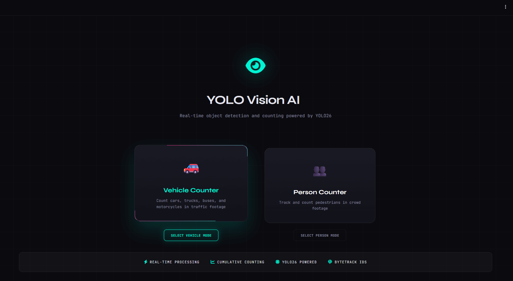
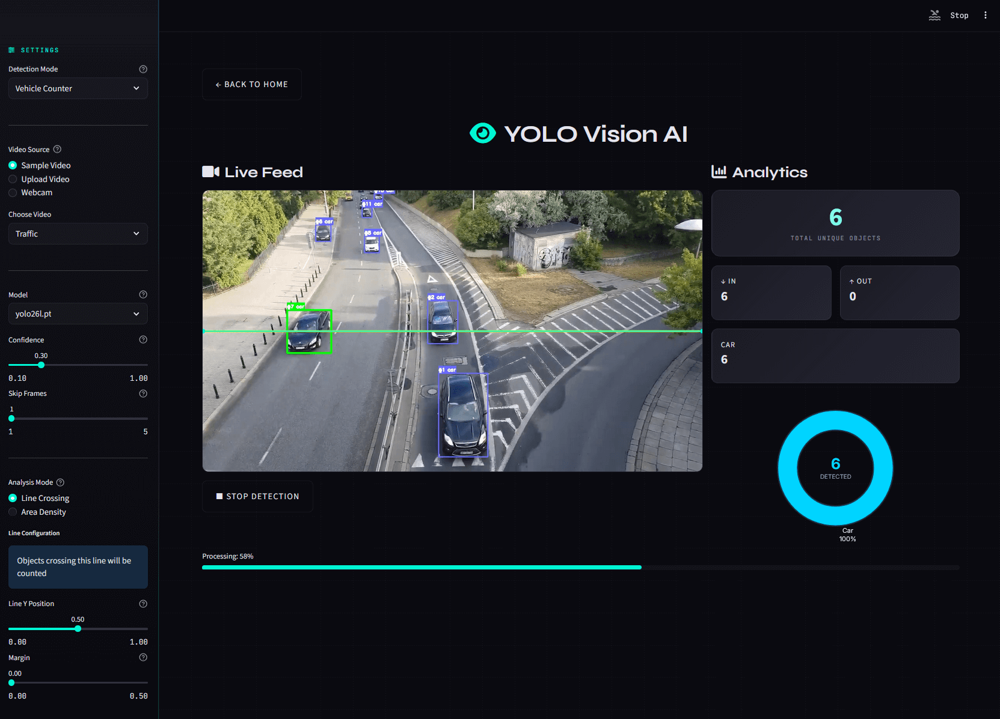
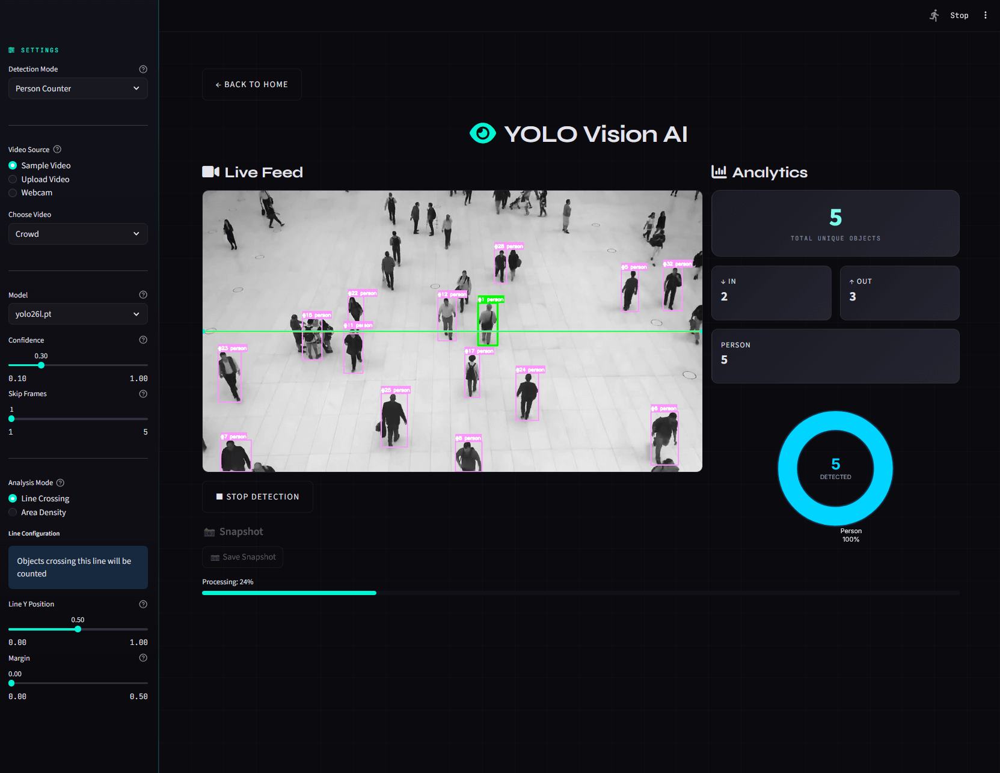
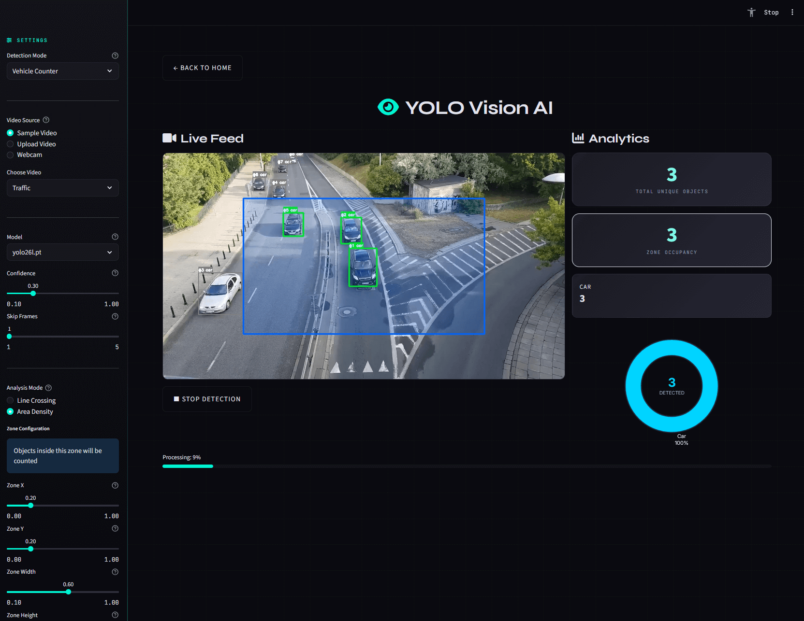
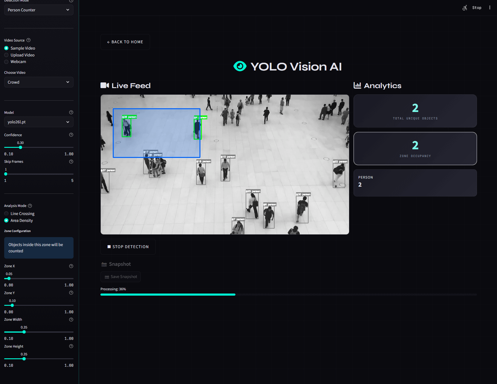

<div align="center">

# 🔮 YOLO Vision AI

### Real-Time Traffic & Crowd Analytics Platform

**Computer Vision Dashboard for Vehicle Counting, Pedestrian Tracking & Zone Occupancy Analysis**

Powered by YOLOv8 • ByteTrack • Streamlit • OpenCV

<br/>

[](https://www.python.org/)
[](https://ultralytics.com/)
[](https://streamlit.io/)
[](https://opencv.org/)
[](LICENSE)

<br/>

<!-- Add your screenshots here -->



[Features](#-features) •
[Demo](#-demo) •
[Architecture](#-architecture) •
[Installation](#-installation) •
[Usage](#-usage) •
[Technical Details](#-technical-details) •
[Roadmap](#-roadmap)

</div>

---

## 🎯 Features

### Detection Modes

| Mode                 | Description                                                                                       | Use Cases                                     |
| -------------------- | ------------------------------------------------------------------------------------------------- | --------------------------------------------- |
| **🚗 Line Crossing** | Counts vehicles/people crossing a virtual line. Tracks direction (In/Out) with cumulative totals. | Highway traffic counting, entrance monitoring |
| **👥 Area Density**  | Real-time occupancy count within a defined rectangular zone. Green highlights for objects inside. | Crowd density, parking lot occupancy          |

### Core Capabilities

- ✅ **Real-time Object Detection** using YOLOv8 (nano to large models)
- ✅ **Persistent Object Tracking** via ByteTrack algorithm
- ✅ **Cumulative Line Crossing** with direction detection (In/Out)
- ✅ **Zone Occupancy Monitoring** with visual color coding
- ✅ **Live Analytics Dashboard** with premium Plotly charts
- ✅ **Visual Feedback** — Green flash effect when objects cross the line
- ✅ **Multiple Video Sources** — Sample videos, file upload, webcam
- ✅ **Configurable Detection** — Adjustable confidence, line position, zone size

### Detected Classes

| Vehicle Counter | Person Counter |
| --------------- | -------------- |
| 🚗 Car          | 🚶 Person      |
| 🏍️ Motorcycle   |                |
| 🚌 Bus          |                |
| 🚚 Truck        |                |

---

## 📸 Demo

### Line Crossing Mode

#### Vehicle Counter



_Vehicles crossing the yellow line are counted from both directions_

#### Person Counter



_Pedestrians crossing the line are tracked individually_

### Area Density Mode

#### Vehicle Counter



_Real-time occupancy tracking of vehicles within the blue zone_

#### Person Counter



_Crowd density monitoring in public spaces_

---

## 🏗️ Architecture

```
┌─────────────────────────────────────────────────────────────────┐
│                        YOLO Vision AI                           │
├─────────────────────────────────────────────────────────────────┤
│                                                                 │
│  ┌─────────────┐    ┌──────────────┐    ┌─────────────────┐    │
│  │   Input     │    │   Processing │    │    Output       │    │
│  │             │    │              │    │                 │    │
│  │ • Video     │───▶│ • YOLOv8     │───▶│ • Annotated    │    │
│  │ • Webcam    │    │ • ByteTrack  │    │   Video        │    │
│  │ • RTSP      │    │ • Line Zone  │    │ • Live Stats   │    │
│  │             │    │ • Region Zone│    │ • Plotly Charts│    │
│  └─────────────┘    └──────────────┘    └─────────────────┘    │
│                                                                 │
│  ┌─────────────────────────────────────────────────────────┐   │
│  │                    Streamlit Dashboard                   │   │
│  │  • Premium Neo-Noir UI  • Real-time Updates             │   │
│  │  • Responsive Layout    • Custom CSS Styling            │   │
│  └─────────────────────────────────────────────────────────┘   │
│                                                                 │
└─────────────────────────────────────────────────────────────────┘
```

### Tech Stack

| Layer             | Technology              | Purpose                                      |
| ----------------- | ----------------------- | -------------------------------------------- |
| **Detection**     | YOLOv8 (Ultralytics)    | Object detection with multiple model sizes   |
| **Tracking**      | ByteTrack (Supervision) | Multi-object tracking with persistent IDs    |
| **Frontend**      | Streamlit               | Interactive dashboard with real-time updates |
| **Styling**       | Custom CSS              | Premium neo-noir theme with animations       |
| **Visualization** | Plotly                  | Dynamic donut charts with hover effects      |
| **Video I/O**     | OpenCV                  | Frame capture, annotation, and display       |
| **Config**        | Python dataclasses      | Type-safe configuration management           |

---

## 🚀 Installation

### Prerequisites

- Python **3.8+**
- Git
- (Optional) NVIDIA GPU with CUDA for faster inference

### Quick Start

```bash
# Clone the repository
git clone https://github.com/yourusername/yolo-vision-ai.git
cd yolo-vision-ai

# Create virtual environment
python -m venv venv

# Activate (Windows)
venv\Scripts\activate

# Activate (macOS/Linux)
source venv/bin/activate

# Install dependencies
pip install -r requirements.txt

# Run the dashboard
streamlit run dashboard.py
```

The app will open at `http://localhost:8501`

### Dependencies

```
ultralytics>=8.0.0    # YOLOv8 models
opencv-python>=4.8.0  # Video processing
streamlit>=1.28.0     # Dashboard UI
numpy>=1.24.0         # Array operations
pandas>=2.0.0         # Data handling
plotly>=5.18.0        # Interactive charts
supervision>=0.16.0   # ByteTrack integration
Pillow>=10.0.0        # Image handling
```

---

## 💻 Usage

### Dashboard Controls

#### 1. Detection Mode

- **Vehicle Counter** — Detects cars, buses, trucks, motorcycles
- **Person Counter** — Optimized for pedestrian detection

#### 2. Analysis Mode

- **Line Crossing** — Count objects crossing a virtual line
  - Adjust **Y Position** (0.0 = top, 1.0 = bottom)
  - Adjust **Margin** to shorten line from edges
- **Area Density** — Count objects inside a zone
  - Configure **X, Y, Width, Height** of the zone

#### 3. Model Selection

| Model        | Speed      | Accuracy | GPU Memory |
| ------------ | ---------- | -------- | ---------- |
| `yolov8n.pt` | ⚡ Fastest | Good     | ~2GB       |
| `yolov8l.pt` | Medium     | Better   | ~6GB       |
| `yolo26l.pt` | Slower     | Best     | ~8GB       |

#### 4. Confidence Threshold

- **Low (0.1-0.3)** — Detect more objects, higher false positives
- **High (0.7-1.0)** — Only confident detections, may miss objects

---

## 🔧 Technical Details

### Line Crossing Algorithm

```python
# Cross-product method for line intersection detection
def is_crossing(prev_pos, curr_pos):
    # Calculate which side of the line each point is on
    prev_side = cross_product(line_vector, prev_pos - line_start)
    curr_side = cross_product(line_vector, curr_pos - line_start)

    # If signs differ, the trajectory crossed the line
    if prev_side * curr_side < 0:
        # Verify crossing point is within line bounds
        return 'in' if curr_side > 0 else 'out'
```

### Memory Optimization

- **Bounded Track History**: Uses `deque(maxlen=30)` for automatic memory management
- **Stale Track Pruning**: Removes tracking data for objects no longer in frame
- **CSS Caching**: `@st.cache_data` prevents disk I/O on every rerun

### Performance Tips

1. Use **Skip Frames** (2-3) for faster processing on slower hardware
2. Choose **yolov8n.pt** for real-time performance without GPU
3. Reduce **Confidence** slightly to catch more objects in crowded scenes

---

## 📁 Project Structure

```
📦 yolo-vision-ai
├── 📜 dashboard.py        # Streamlit UI & main application (670 lines)
├── 📜 vehicle_counter.py  # YOLO processor, tracking & counting (350 lines)
├── 📜 config.py           # Centralized configuration constants
├── 📜 styles.css          # Premium neo-noir CSS theme (750 lines)
├── 📜 requirements.txt    # Python dependencies
├── 📂 .streamlit/
│   └── config.toml        # Streamlit configuration
├── 📂 videos/             # Sample video files
│   ├── traffic.mp4
│   └── crowd.mp4
├── 📜 yolo26l.pt          # YOLO model (53MB)
├── 📜 yolov8l.pt          # YOLO model (88MB)
├── 📜 yolov8n.pt          # YOLO model (6.5MB)
└── 📜 README.md           # This file
```

### Key Classes

| Class            | File               | Purpose                            |
| ---------------- | ------------------ | ---------------------------------- |
| `YOLOProcessor`  | vehicle_counter.py | Main detection & tracking engine   |
| `LineZone`       | vehicle_counter.py | Line crossing geometry & detection |
| `RegionZone`     | vehicle_counter.py | Rectangular zone occupancy         |
| `DetectionCount` | vehicle_counter.py | Dataclass for count results        |

---

## 🔮 Roadmap

- [ ] 📷 **RTSP/CCTV Stream Support** — Connect to IP cameras
- [ ] 🚘 **License Plate Recognition** — OCR for vehicle plates
- [ ] 📊 **Data Export** — CSV/Excel export of counts
- [ ] 🖥️ **Multi-Camera Dashboard** — Side-by-side view
- [ ] ☁️ **Cloud Deployment** — Docker + Streamlit Cloud
- [ ] 📱 **Mobile Responsive** — Better tablet/phone support

---

## 📄 License

This project is licensed under the MIT License - see the [LICENSE](LICENSE) file for details.

---

## 👩‍💻 Author

**Dr. Murat Altun & Rana Selim**  
Computer Vision • Deep Learning • Smart City Analytics

📫 Contributions, issues, and feature requests are welcome!

---

<div align="center">

**Built with ❤️ using YOLOv8 & Streamlit**

</div>
